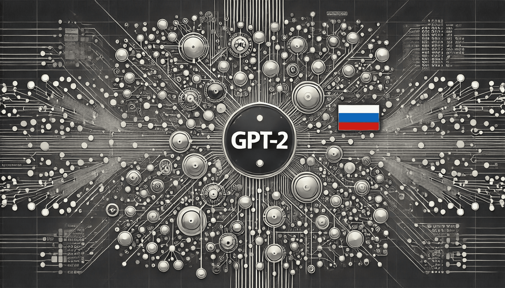

# Fine-tuning the GPT-2 model for generating descriptions of establishments based on name, classes and rating

<p align="center">
  
</p>

This project demonstrates the fine-tuning and application of a GPT-2 based model for generating text specific to product names and categories. The project utilizes the powerful GPT-2 architecture to produce contextually relevant descriptions that align with provided product characteristics such as name, category, and rating.

## Articles

- [Russian](docs/article_ru.md)

## Dataset

The dataset used for fine-tuning the model is the "geo-reviews-dataset-2023" from Hugging Face, which includes a variety of product names, categories, and ratings. This dataset provides a rich set of inputs for training the model to generate meaningful and context-aware text descriptions.

- **Dataset Source**: [geo-reviews-dataset-2023 on Hugging Face](https://huggingface.co/datasets/d0rj/geo-reviews-dataset-2023?row=1)

## Model

The base model used for fine-tuning is the "ai-forever/rugpt3small_based_on_gpt2" from Hugging Face. This model offers a robust starting point for further training and adaptation to specific text generation tasks.

- **Model Source**: [ai-forever/rugpt3small_based_on_gpt2 on Hugging Face](https://huggingface.co/ai-forever/rugpt3small_based_on_gpt2)

## Requirements

To install the necessary libraries for running the project, please use the provided `requirements.txt` file. This file contains all the dependencies required to execute the project successfully.

```bash
pip install -r requirements.txt
```

## Usage

To run the project, follow these steps:

1. Clone the repository to your local machine.
2. Ensure that Python and Pip are installed.
3. Install the required packages using the `requirements.txt` file.
4. Run the script to fine-tune the model with the dataset provided.
5. Use the trained model to generate text based on new product information.

## Contributing

Contributions to this project are welcome. Please feel free to fork the repository, make changes, and submit a pull request. We appreciate your inputs to improve the project.

## Citation

```latex
@misc{pisarenko2024fine-tuning,
  author = {Pisarenko, Anton},
  title = {Fine-tuning the {GPT-2} model for generating descriptions of establishments based on type and rating},
  year = {2024},
  howpublished = {\url{https://github.com/AntonSHBK/fine_tune_gpt_model}},
}
```

## Contacts

* [Telegram](https://t.me/antonSHBK)

## License

This project is licensed under the MIT License - see the [LICENSE.md](LICENSE.md) file for details.